# Visit Stoke Newington 

[View live project here on GitHub](https://stokeydev.github.io/pa1/)

Visit Stoke Newington is the go-to site for those who wish to visit Stoke Newington. It has information on the area, from what people can do, to it's history. It also has images, recccomended walks and a page where people can tell us how they can support us in our aim to inform the general public on what a great area Stoke Newington is.  

   
  

---

## CONTENTS  
  
* [UXD (User Experience Design)](#user-experience-ux)
  * [User Stories](#user-stories) 
* [Creation process (Strategy -> Surface)](#creation-process)
  * [Wireframes](#wireframes)
* [Design](#design)
  * [Colour Scheme](#color-scheme)
  * [Typography](#typography)
  * [Imagery](#imagery)
* [Page Features](#page-features)
  * [Navbar](#navbar)
  * [Hero-Image](#hero-image)
  * [Tagline](#tagline)
  * [What to do page](#what-to-do-page)
  * [History Page](#history-page)
  * [Support us Page](#support-us-page)
  * [Footer](#footer)  
* [Tablet & Mobile View](#tablet--mobile-view)
  * [Desktop, Tablet & Mobile Differences](#desktop-tablet--mobile-differences)
  * [Tablet View](#tablet-view-ipad-miniipad-prosurface-pro)
  * [Mobile View](#mobile-view-iphone-5iphone-seiphone-xriphone-12-pro)
* [Future Features](#future-features)
* [Technologies Used](#technologies-used)
  * [Languages Used](#languages-used)
  * [Frameworks, Libraries, Technologies & Programs Used](#frameworks-libraries-technologies--programs-used)
* [Deployment](#deployment)
  * [How to deploy](#how-to-deploy)
* [Testing](#testing)
  * [HTML Validation using W3C Validation](#html-validation-using-w3c-validation)
  * [CSS Validation using W3C Validation](#css-validation-using-w3c-validation)
  * [Lighthouse scores via Chrome Developer Tools](#lighthouse-scores-via-chrome-developer-tools)
  * [Bugs & Fixes](#bugs--fixes)
  * [Unsolved Bugs](#unsolved-bugs)
* [Credits](#credits) 

  
---    

## User Experience (UX)  
  
### **User Stories**  

### **Primary Goal**  
  
Visit Stoke Newington aims to inform the general public about the splendors of Stoke Newington. It lets people know what they can get up, from walking tours, informing them what bars, pubs, restaurants, and cafes are available, what the local sports amenities are, along with the hisotry of the neighbourhood

### **Visitor Goals** 

Visitors will be from all different backgrounds, and thus it is a goal of the website to be straight to the point and easy to use for those seeking information about: what to do, the history of the area, and how people can get involved. The site is designed to be responsive to allow visitors to view it from a range of devices. The basic information is easily accessible from every page via the footer, which makes for easy navigation and no need to use a "back" button. In addition, an interactive Google Map is also on the page in order to direct those not familiar with the neighborhood.  

### **First Time Visitor**
  - A user can access each page of the site with one click via the navigation bar.
  - A user can view images of Stoke Newington, located at the center of the landing page.
  - A user can view the basic information of the site via the footer.
  - A user can find a video tour of the area.

### **Returning Visitor**  
  - A user can quickly access the other pages via the landing page to revisit information or find new information.
  - A user can learn about the history of the area.
  - A user can find social media links in the footer.
  - A user can use the contact form to connect with the community.
  
### **Frequent Visitor**  
  - A user can see what they can do in the neighbourhood.
  - A user can view the social media links to check for updates (if any).    

--- 

## Creation Process  
  
### **1. Strategy**  

- I required an easy-to-read, dependable website that delivers clear information about what to do the and breif history of the area.  
- I wanted to show off the highlights of the area as soon as people enter the site so it stands out and makes the site look attractive, hence the   
  carousel.  
- A clean design and use of graphics and colour to evoke an emotional and familiar connection for the user has been adapted - no big bright colours, a simple and clean look suits everyone and is a modern, respectable approach.  
- Information about this site is to be transparent and simple.  
- Mobile responsiveness is an essential feature required for this website.
  

### **2. Scope**  

The site must be available on a wide range of devices due to the varied range of bacgkrounds visiting the site. A range of visitors will be there for different reasons, but will want the same information - if someone lives there, they might not know everything their neighbourhood has to offer, and a first time visitor will want the main highlights. The site provides a comfortable, no-fuss website which doesn't have endless amounts of information.

- The site is to contain only essential information, presented in a similar fashion and layout.   
- Text must be clear and legible on any sized device to allow the user instant access to the relevant pages, and different parts of the pages.  
- Three images that show off Stoke Newington is included on the home page.  
- For future development, the information on what to do can be updated, such as the fairs and festivals page, or any new developments in the area can be incorporated into the site. The website can possibly be translated into other languages, depending on who visits.
  

### **3. Structural**  

Similar to the idea for the design and layout to be accessible and functional, simple navigation and interactivity is essential. The site needs to provide information swiftly no matter the background of the user.  
- Easy to identify, clickable links with a consistent layout. The design is to be predictable for each page with the information clearly identifiable.  
- Any buttons or links had to provide feedback to the user to identify their purpose in the form of a design change that followed the flow of the overall aesthetic.  
- A large, clear button to bring the user directly to the other pages would be placed front and center of their eye-line.  
- In addition, a navigation bar and footer would be visible on every page, at every device size, displaying the same information. This would provide the returning visitors with a faster route to their information destination, strengthening the site's familiar and trusting feeling.  

  
### **4. Skeleton**  

The site was developed to be simple, clear, and familiar.  

- For the landing page, the logo, a castle (chosen because there's a castle in Stoke Newington), was to be top-left of every page, no matter the orientation or screen size.  
- The simple, four-item navigation bar of 'Home', 'What to do', 'History', and 'Support us', is situated always to the right of the logo. The page the user is on will be highlighted on the nav bar.  
- A large, clear image dominates the landing page with a nice view of Clissold House and St. Mary's Church (new).  
- Centered in the image is a tagline welcoming visitors. First-time visitors have access to the what to do, history and support us pages with one easy click.  
- For returning or curious visitors, scrolling down the page introduces them to a brief, three-piece of information sections of the website. Images are visible on one side of the headed paragraphs.  
- Just before the footer, there is a nice youtube video which shows off Stoke Newington - this helps people visualise the neighbourhood, and some people might find the youtube video sufficient.
- The page ends with the footer, again offering three pieces of important information to the user, links to other pages, location, and social media.  

- For the what to do page, the navigation bar and footer remain as before. There is an interactive content section at the top laid out as cards, with an image and title -people can jump to seciton they want to find out about by clicking a button rather than having to scroll all the way down. Users have the option to also jump back to the top via a button rather than having to scroll all the way back up as well. All sections are split into two: information and a relevant image. 

- For the history page, the navigation bar and footer remain as before. There is a timeline with a title and icon represnting the time, along with informaiton about said period. The timeline is progressive, starting from a certain point of history and progressing towards the modern period.
  
- For the support us page, the navigation and footer remain as before. There is a form where people can write in how they can help the website, and an image accompanying the form.

### Wireframes  

Wireframe - Homepage Desktop & Mobile
  

 

Wireframe - What to do page Desktop
  

 

Wireframe - What to do page Mobile
  

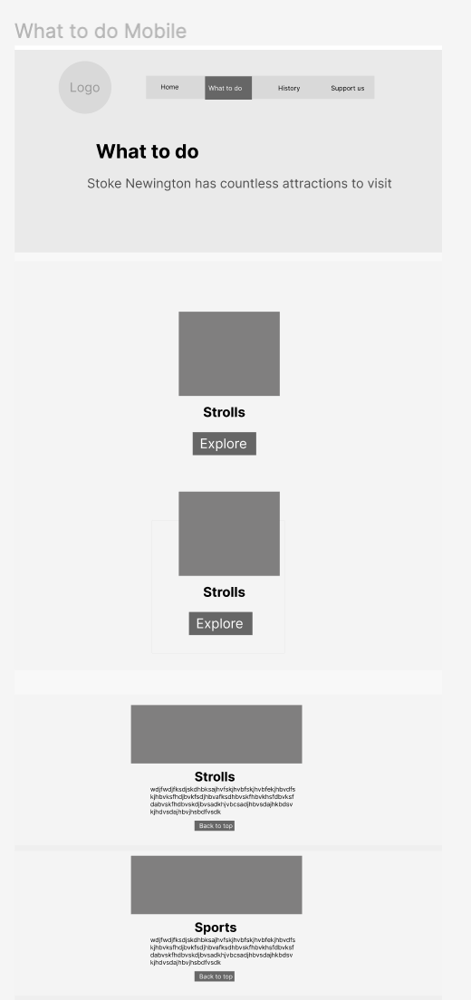

    

Wireframe - History page Desktop & Mobile
  

 
          

Wireframe - Support us page Desktop
  

 

Wireframe - Support us page Mobile
  

         

### **5. Surface**  

 A design was created that allowed a consistent flow throughout the four-page site.   
 - A white background was kept to contrast with the images and content.  
- A palette of back and white was chosen to give it a clean, easily accessible and modern look.  
- The fonts were kept to the default so as to keep the clean and accessibe look consistent throughout the site.  

Overall, the design intends to make the website seem welcoming, non-threatening and easily accessible.  
 
---   
  
  
## Design  

### **Color Scheme**  

This website used a fresh, bold palette of blues and reds to capture the aesthetic of a traditional ice cream parlour. The colours reminded me of ice cream wrappers and packaging. I combined these with an off-white shade that felt paperlike and clean.  
  
  
  
I experienced an issue with the contrast ratio for my buttons. The ratio of the (#78D5F7) blue and (#F53636) red fell short of the acceptable [WCAG](https://www.w3.org/WAI/WCAG21/Understanding/contrast-minimum.html) contrast ratio. To fix this and increase the accessibility of my site I used different shades of these colours to conform.  
  
  
  
[Adobe Color](https://color.adobe.com/create/color-contrast-analyzer) provided this fantastic resource for checking how accessible your colours are. I submitted my palette to the [Color Blind Safe](https://color.adobe.com/create/color-accessibility) check to find they passed this test also.  
  

  
### **Typography**  
  
[Google Fonts](https://fonts.google.com/) was used to import the fonts 'Josefin Sans' and 'Lato'. I felt the clear, soft lettering suited the intended aesthetic of the website. I had intentions to use Lato for my smaller bodies of text, however, I chose to stick with Josefin to keep the font consistent.   
  

        
### **Imagery**  
  
The images that I have chosen for my site reflect the character and charm of Stoke Newington. On the Homepage and the Support us page, all the images were taken by the website creator, Berk Bektas. The site [unsplash.com](https://unsplash.com/) provided the royalty-free stock images used on the 'What to do' page, with attributions to each photographer placed in the alt text.

---  
  

## Page Features  

### **Navbar**   

  

  
  

This remains the same across the three pages, in portrait/landscape and mobile/tablet/desktop view.
  
   

### **Hero Image**  

  

  
  

The hero image remains the same across all devices, with the text on the image disappearing on smaller screens.  

  

### **Tagline**  

 

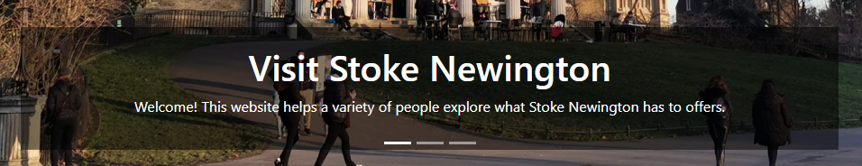  

The tagline image has its opacity set to allow the hero image to still show through.

 

### **What to do page**  

 

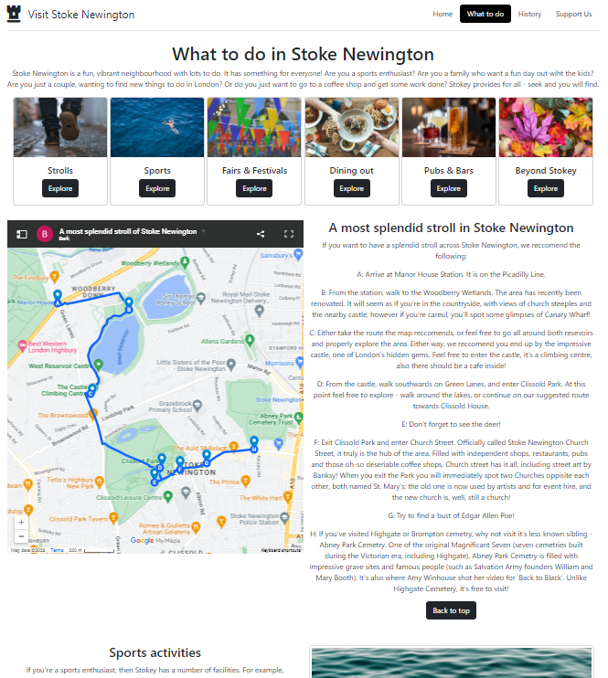  

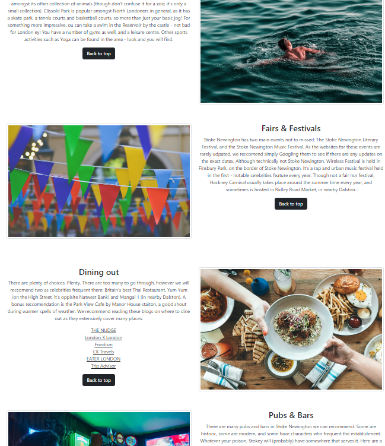  

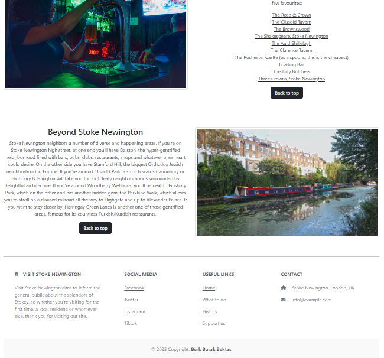  

A table of content/jump to section dominates the first section - users can click the Explore button to take them to a particular section. Below, small portions of text with clear headings are accompanied by images that reflect the topic, apart from the stroll section, which has an interactive map from Google. In tablet/mobile view, these sections are displayed in a column.  

 
  
### **History Page** 

 

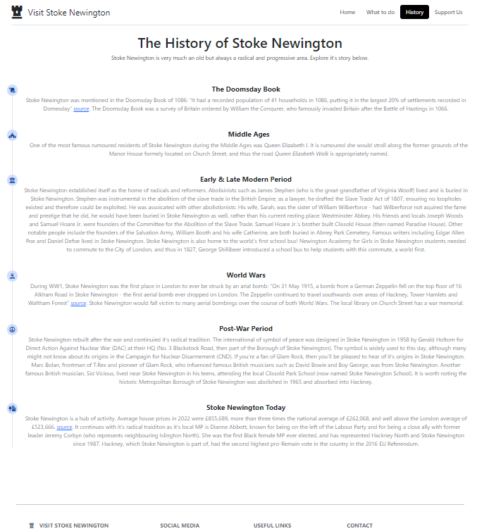  

This page follows a timeline format, with icons representing each era of time. Each era of time is clearly indicated with a large header, with text underneath talking about said era. The page looks similar in all modes of view.

 

### **Support us Page**  

 
 
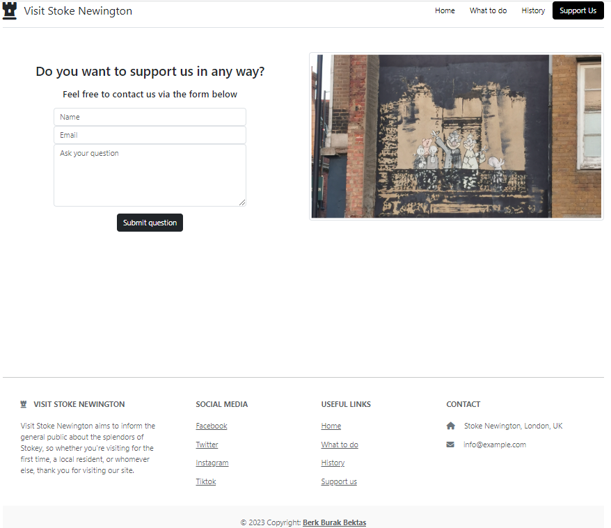  

A simple form, with a nice image of Stoke Newington is included in this webpage. These elements switch to columnar format for tablet/mobile views.

 

### **Footer**  

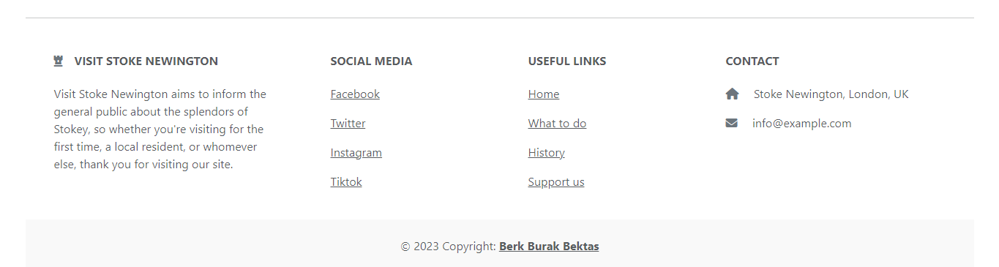 

The footer remains the same throughout the design. It contains a breif summary of the website, along with clickable links to the different pages on the website, along with social media pages the website is connected to.  

---   

## Tablet & Mobile View  
 
### **Desktop, Tablet & Mobile Differences**  
  
To ensure responsivity I used bootstrap's column approach. Main elements in the body of the site i.e. the cards, images with text, and support us sections were displayed in a row format for desktops but this switched to a column for smaller screen sizes. The header and footer remained the same, whilst images were resized to fit the display.
  
### **Tablet View (iPad Mini/iPad Pro/Surface Pro)**  
  
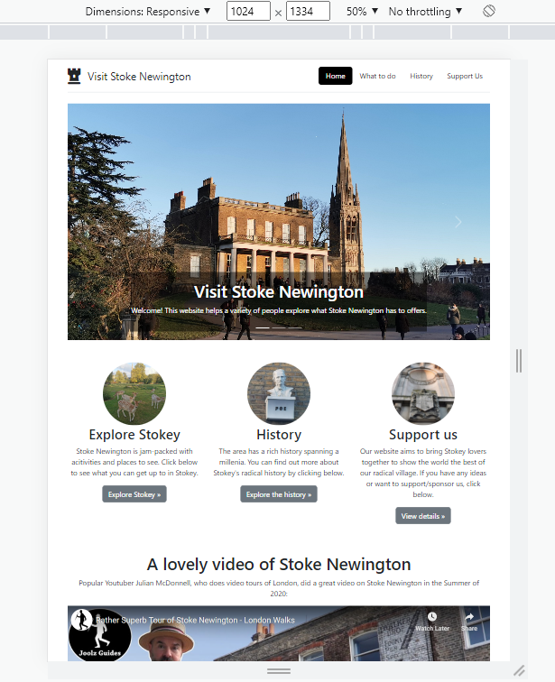
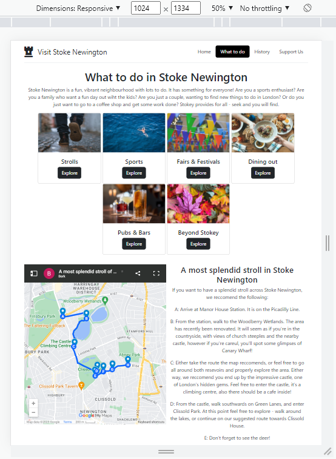

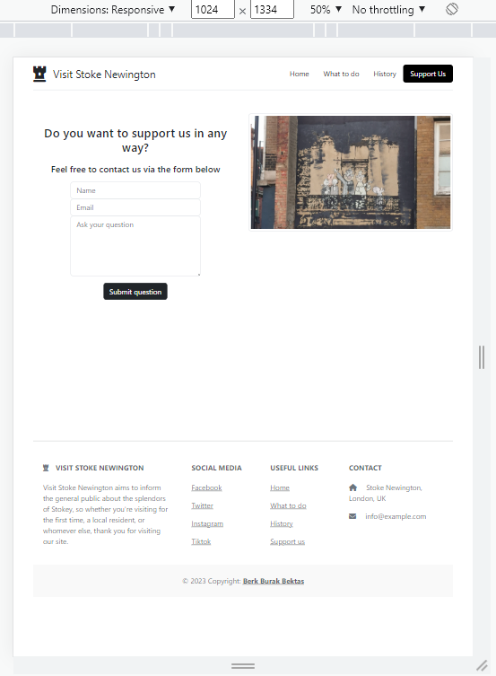

### **Mobile View (iPhone 5/iPhone SE/iPhone XR/iPhone 12 Pro)**  
  
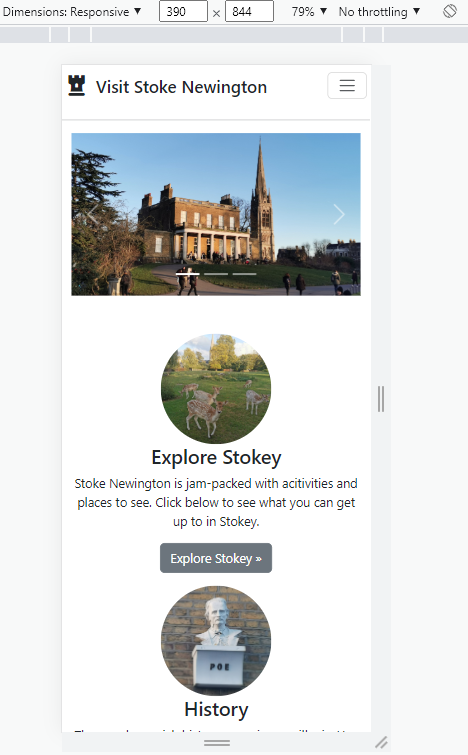
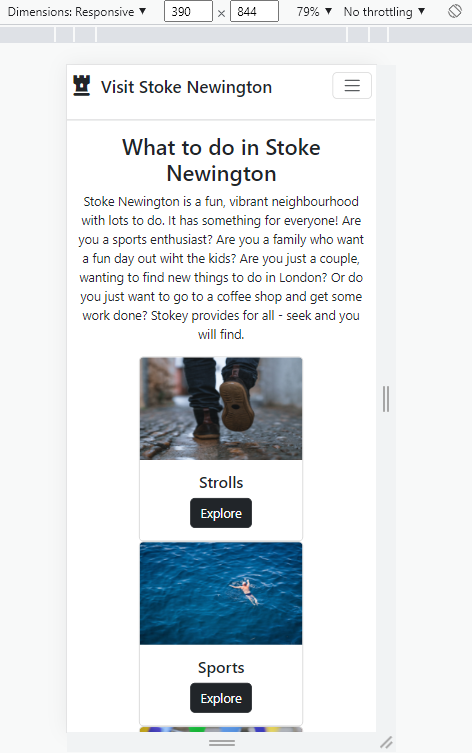
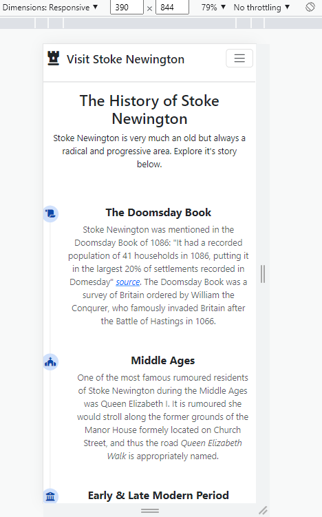
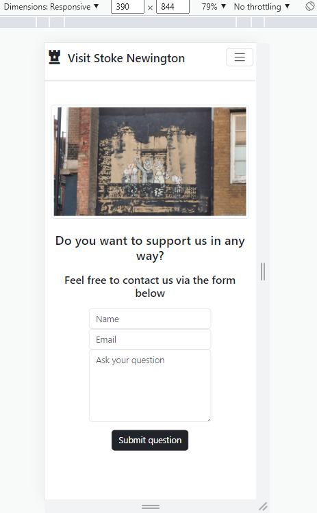

---  
                              

## Future Features  

- For future development, I would like to include an extra page dedicated to ongoing events.
- A section on how to get to Stoke Newington such as a list of underground/overground stations and what buses get there.
  
---   
  

## Technologies Used    

### **Languages Used**   

- HTML5
- CSS3

### **Frameworks, Libraries, Technologies & Programs Used**  

- GitHub - used to save and store all files for this website  
- Git - used for version control
- Google Maps - this was used to add the route for the strolls section
- Font Awesome - icons and their associated kit were downloaded from here   
- Google Dev Tools - to debug and for testing responsiveness 
- Google Lighthouse - for auditing the website
- W3C Validator - for validating the HTML and CSS code 

---   
 

## Deployment

### **How to deploy**  

GitHub was used to deploy the website. These were the steps taken to acheive this:  

1. Login to GitHub account
2. Navigate to the project repository, stokeydev_pa1
3. Click the Settings button near the top of the page
4. In the left-hand menu, find and click on the Pages button
5. In the Source section, choose 'main' from the drop-down, select branch menu
6. Select 'root' from the drop-down folder menu
7. Click 'Save' and after a few moments the project will have been made live and a link is visible at the top of the page

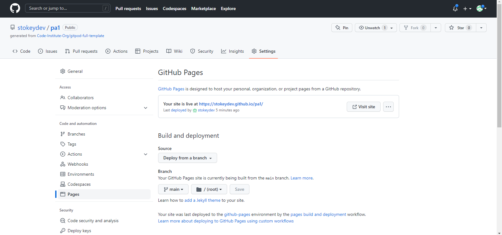 

---  
    

## Testing  

### **Initial testing plan**

I had planned for this site to be accessible and legible on all screen sizes. The user is viewing the site primarily for the menu options and parlour location and they needed to access this information with one click. I used Chrome Dev Tools to test, tweak and debug in the early stages. I deployed my site halfway through to test on real-world devices. These devices included:  
- Acer Aspire 3 Laptop (1920 X 1080)  
- Huawei AD80HW 24" Monitor
- iPad Pro 2021
- iPhone SE(2016)
- Huawei p30 pro 
- iPhone 11/13
- Samsung Galaxy s10 
  
### **Testing**    

Testing took place throughout the entire build using Dev Tools on Chrome and on the above real-world devices. The browsers used were:  
- Chrome  
- Firefox  
- Edge  
- Safari  
  
The results of feature testing are as follows:  
  
| Page | Test | Pass/Fail |
| :----| :----| :--------:|
| All  | Logo links back to homepage | Pass |
| All  | Correct page name highlighted in navigation | Pass |
| All  | Navigation links bring the user to relevant page | Pass |
| All  | Footer social media list in the footer brings the user to relevant sites via a new tab | Pass |
| All  | Useful links list in footer links to correct page | Pass |
| All  | Images and sections are responsive in different media sizes | Pass |
| Index| Hero image loads and carousel works | Pass |
| Index| Youtube video works | Pass | 
| What to do | All buttons scroll to desired place | Pass |
| What to do | Google Maps works and shows correct information | Pass |
| History| Timeline is ligned up correctly | Pass |
| Support us | Contact form required elements are responsive | Pass |
| Support us | Form submit button brings you to a validation page | Pass |

Further device testing took place in Dev Tools on:
  - iPhone 4/5/6/7/8
  - iPhone XR/ iPhone 12 Pro
  - Pixel 5
  - Samsung Galaxy s20

 
### **HTML Validation using W3C Validation**  

Index/landing page HTML validation
  

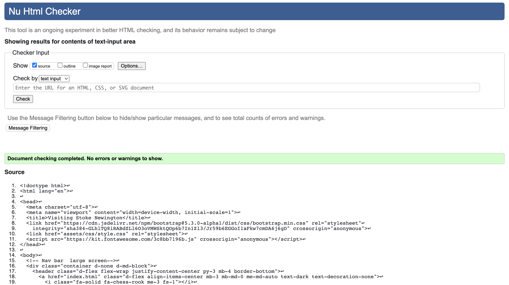

   

What to do page HTML validation
  

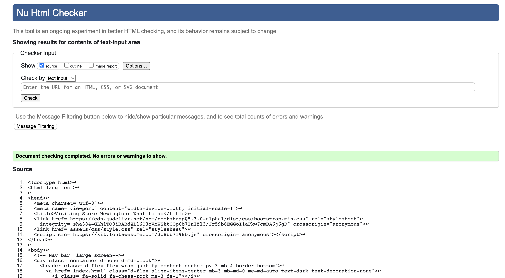

  

History page HTML validation
  

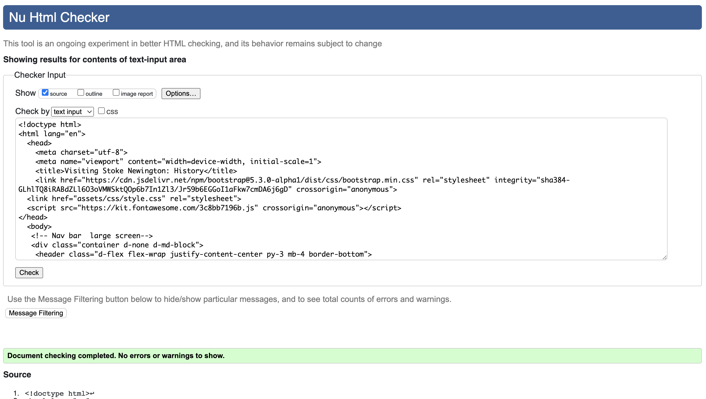

  

Support us page HTML validation
  

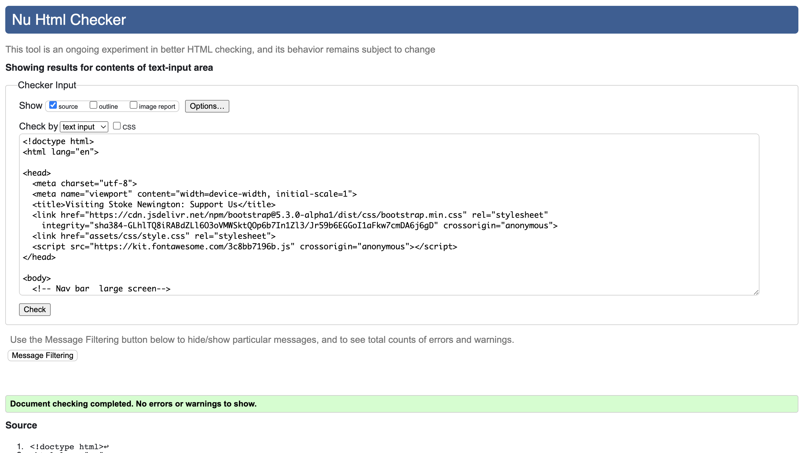

   
   

### **CSS Validation using W3C Validation** 

CSS validation
  

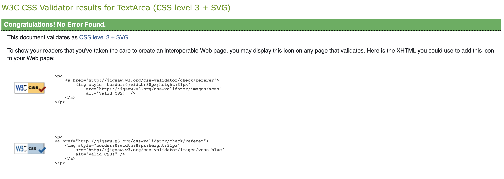

   

   

### **Lighthouse scores via Chrome Developer Tools**   
  
For Desktop   

Lighthouse audit for Index page
  

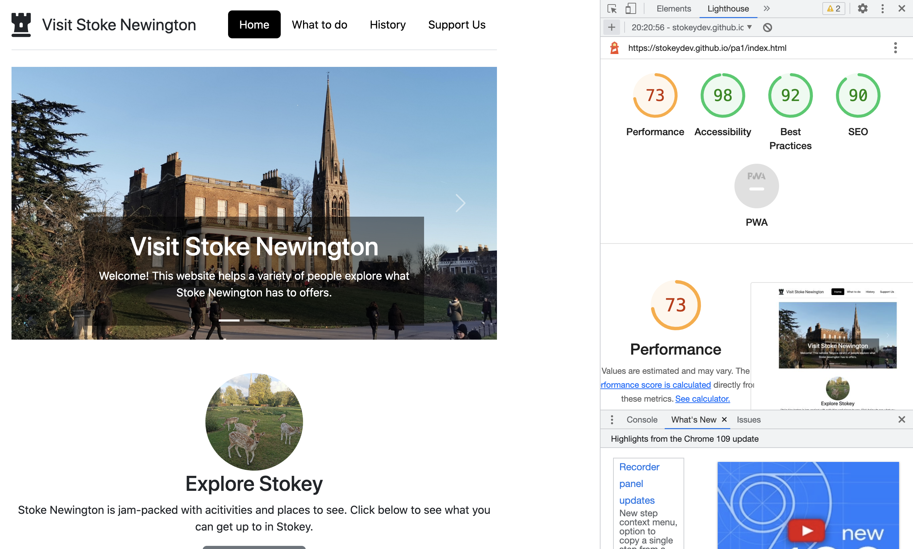

 

Lighthouse audit for What to do page
  

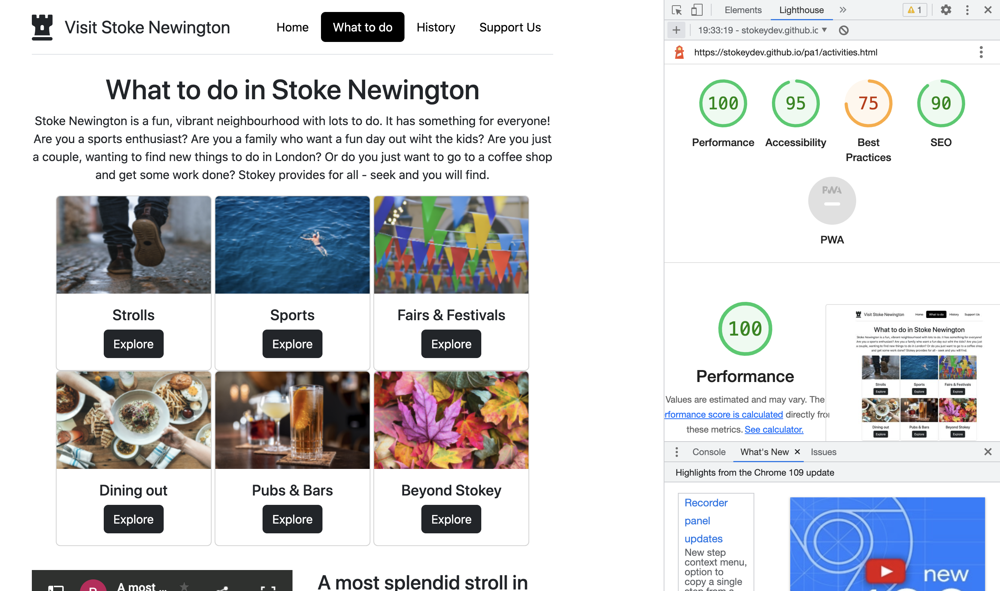

Lighthouse audit for History page
  

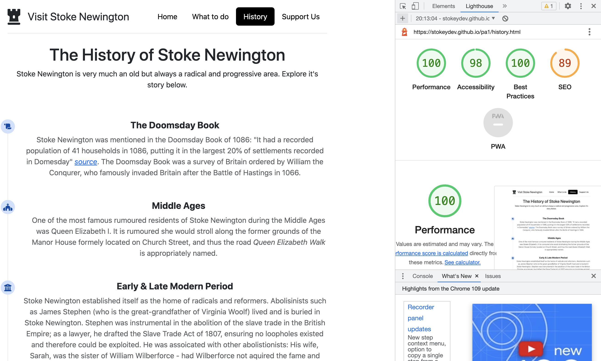

      

Lighthouse audit for Support us page
  

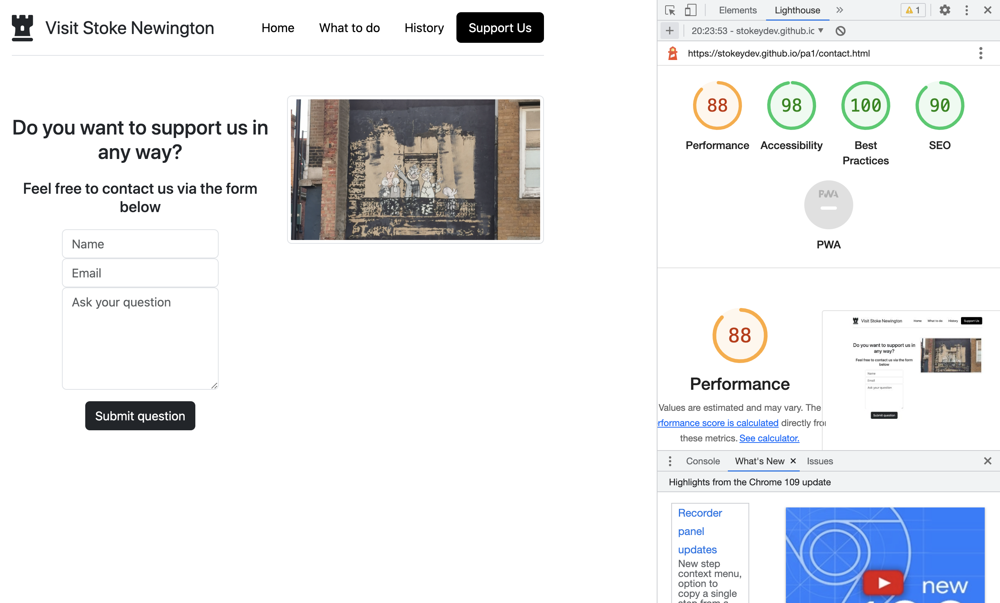

      
 
  
For Mobile   

Lighthouse audit for Index page - Mobile
  

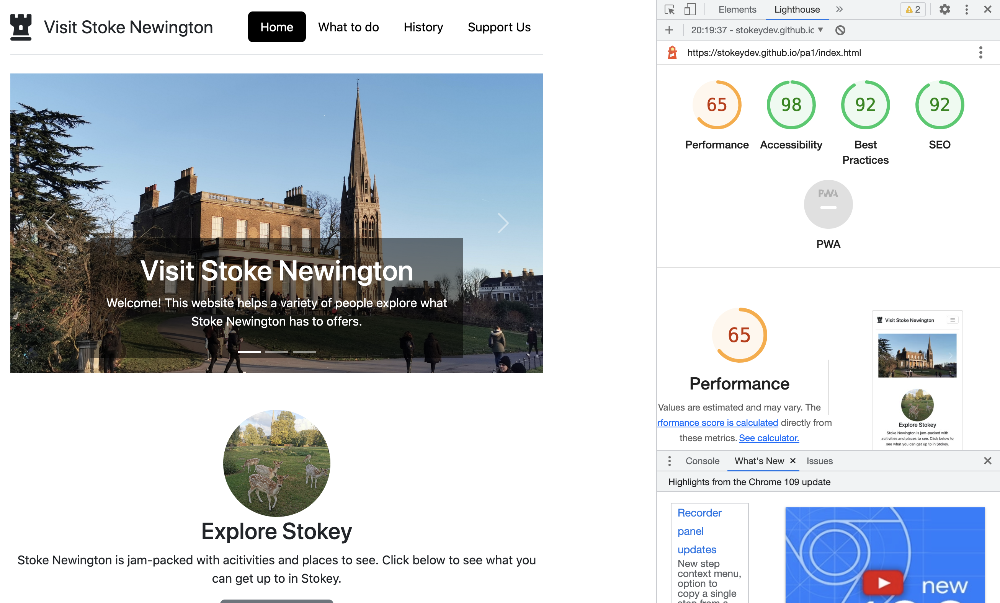

 

Lighthouse audit for What to do page - Mobile
  

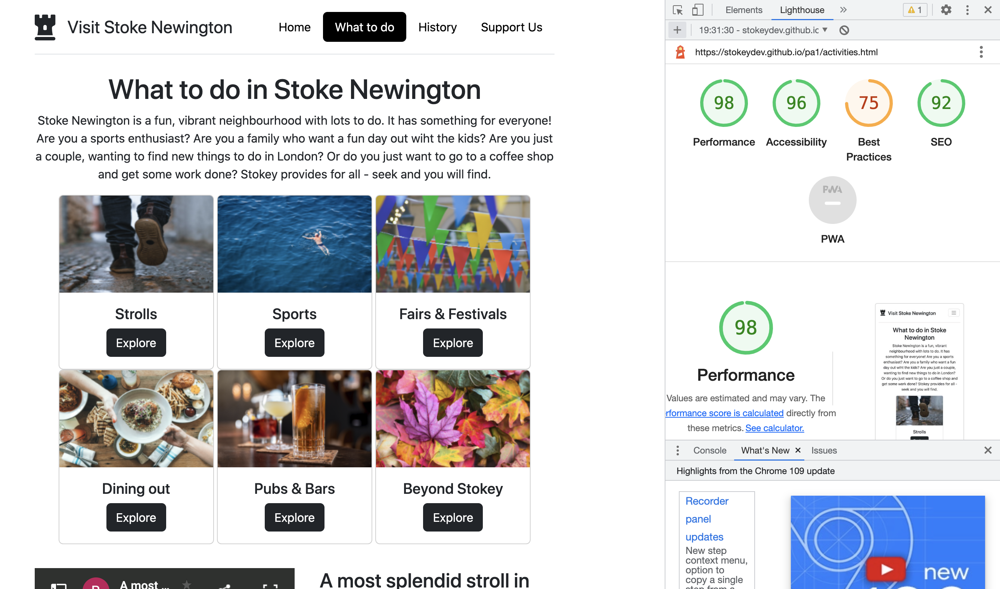

Lighthouse audit for History page - Mobile
  

      

Lighthouse audit for Support us page - Mobile
  

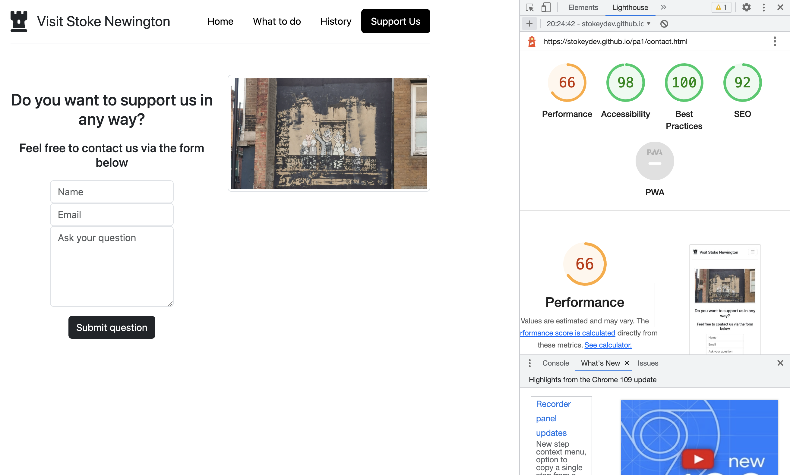

        
  
### **Bugs & Fixes**  
  
| Bug | Section | Fix |
| :----| :----| :--------:|
| Whitespace added to right-hand side of webpages | All pages | Using Dev Tools, I added a thin red border to every element in my website. From this, I discovered that I had mistyped a value in my footer padding section and made it too large. This was pushing the footer element outside of the webpage width. I adjusted the padding to the correct value and the issue was resolved. |
| Nesting button element & anchor element | Index/Home page | When running an early W3C validation test, I discovered that I had made an error by placing a button element inside an anchor element within my tagline section. Semantically, this was incorrect. I considered using a span element instead and upon consulting Stackoverflow and this [post](https://stackoverflow.com/questions/6393827/can-i-nest-a-button-element-inside-an-a-using-html5) I confirmed my understanding. I re-checked my HTML code with W3C Validator and my live site to find the issue resolved. |
| Flexbox issues with positioning business ethos section - elements bunched together | Index/Home page | As I was learning flexbox whilst completing the project, I had not yet fully understood the div parent/child relationship. I consulted the Mozilla Developer Docs for Flexbox and discovered that I was not using enough divs for the elements to display correctly. I placed each of my headings, paragraphs, and images within divs and applied flexbox properties to their parent divs and themselves. Assigning flex-direction: row and justify-content: space-around/space-between solved my issue, with each of the elements positioning themselves with appropriate spacing between. I then applied this structure to the remaining two ethos items. |
| br element in li element  | Menu Page |  Semantically I made an error by using the br element to make space between my menu items. On performing the W3C validation test, I became aware of this error. I considered using margin-top to fix the issue. I Googled the issue to understand my error further and came across a Stackoverflow [post](https://stackoverflow.com/questions/66564503/wrong-validation-on-element-br-in-ul-li-elements), with a comment from Quentin detailing how to use margin-top avoiding the first child element of the parent div. I used this piece of code in my CSS file to control the spacing between the menu items after understanding the code fully. |
| Viewport meta tag  | Head section/All pages | On first deploying my website to real devices, the mobile pages were appearing zoomed in upon loading. They appeared normally on Dev Tools mobile testing sizes. I checked my CSS code and my viewport meta tag for any obvious errors. Upon finding none I consulted Stackoverflow to find this [post](https://stackoverflow.com/questions/14272420/webpage-starts-zoomed-in-on-mobile-devices). I removed the initial-scale=1.0 from the viewport meta tag, leaving only width=device-width, I ran the code through the W3C Validator to find no errors. This fixed the issue on all real-world mobile and tablet devices |
| Index page styling disappeared | Index/Home page | Due to commenting out the wrong section of CSS code, I had caused styling on my home page to disappear. Checking the code, I spotted the error and rectified it. |
| Textarea misalignment | Contact page | Due to a developer mistype, I had altered my CSS code for my contact form textarea. I re-added display:block and margin:auto to center the element again. |

### **Unsolved Bugs** 

- On viewing my deployed site on Safari browser, I found the Josefin Sans font to be displayed differently in the header elements. The website is still displayed adequately despite this issue. I will continue my learning to understand how to combat small, browser display differences to discover if I can overcome this.

- On occasion, when viewing my website in Dev Tools, a small amount of whitespace appears to the right of the Home page. When I refresh the page or clear the cache, this issue resolves itself. I have not figured out yet why this happens on rare occasion.

- Even though my site is responsive on Dev Tools and on real world devices, it does not work on multiple-media, screenshot generating websites like 'ui.dev/amiresponsive'. It appears zoomed in, similar to the viewport meta tag issue as documented above. I have yet to figure out why this is the case.

---  

## Credits  
  
### **Content References**
- All content written for the website is by myself, is purely fictional, and for educational purposes only.
- [Code Institute](https://codeinstitute.net/ie/) for their HTML/CSS learning material and 'content zoom' module in the Love Running project.
- [W3Schools](https://www.w3schools.com/) for additional learning material.
- [MDN Web Docs](https://developer.mozilla.org/en-US/docs/Learn/CSS/CSS_layout/Flexbox) for flexbox tutorials and guidance.
- [dev.to](https://dev.to/snkds/how-to-create-striped-backgrounds-with-css-5dfn) for the CSS diagonal stripes tutorial.
- Alan from Code Institute Tutor Support for helping me with an element width issue in my media queries.
- [StackOverflow](https://stackoverflow.com/questions/66564503/wrong-validation-on-element-br-in-ul-li-elements) guidance on removing br element from menu li items to improve semantic HTML
- [Browserstack](https://www.browserstack.com/guide/what-are-css-and-media-query-breakpoints#:~:text=Essentially%2C%20media%20query%20breakpoints%20are,offers%20an%20optimal%20user%20experience.) for media queries and breakpoints guidance.
- [Elaine Broche](https://github.com/elainebroche-dev/ms1-thrive) Design inspired by Elaine's striking juice website.
- [Kera Cudmore - Creating your First README](https://github.com/kera-cudmore/readme-examples) for README structure and Markdown guidance. 
  

### **Media References**  
  
- [Unsplash](https://unsplash.com/), [Pexels](https://www.pexels.com/), and [Pixabay](https://pixabay.com/) for all images used on this site. Credit to photographers Jonathan Cooper, Lukas, Katie Rainbow, Kyle Hinkson, and Dulce Silvagni.
- [Font Awesome](https://fontawesome.com/) for the icons used in the footer of this site.
- [Favicon](https://favicon.io/) for the favicon used for this site.
- [Google Maps](https://www.google.com/maps) for the map used in this site.

### **Acknowledgements** 
- I would like to acknowledge my Code Institute mentor, Rahul Lakhanpal, for his guidance and encouragement on this project.
- My family for testing my work and offering positive thoughts and hot cups of tea throughout the project.
