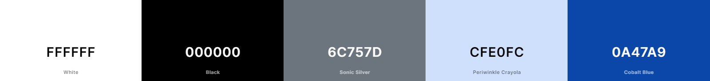

# Visit Stoke Newington 

[View live project here on GitHub](https://stokeydev.github.io/pa1/)

Visit Stoke Newington is the go-to site for those who wish to visit Stoke Newington. It has information on the area, from what people can do, to it's history. It also has images, recccomended walks and a page where people can tell us how they can support us in our aim to inform the general public on what a great area Stoke Newington is.  

   
  

---

## CONTENTS  
  
* [UXD (User Experience Design)](#user-experience-ux)
  * [User Stories](#user-stories) 
* [Creation process (Strategy -> Surface)](#creation-process)
  * [Wireframes](#wireframes)
* [Design](#design)
  * [Colour Scheme](#color-scheme)
  * [Typography](#typography)
  * [Imagery](#imagery)
* [Page Features](#page-features)
  * [Navbar](#navbar)
  * [Hero-Image](#hero-image)
  * [Tagline](#tagline)
  * [What to do page](#what-to-do-page)
  * [History Page](#history-page)
  * [Support us Page](#support-us-page)
  * [Footer](#footer)  
* [Tablet & Mobile View](#tablet--mobile-view)
  * [Desktop, Tablet & Mobile Differences](#desktop-tablet--mobile-differences)
  * [Tablet View](#tablet-view-ipad-miniipad-prosurface-pro)
  * [Mobile View](#mobile-view-iphone-5iphone-seiphone-xriphone-12-pro)
* [Future Features](#future-features)
* [Technologies Used](#technologies-used)
  * [Languages Used](#languages-used)
  * [Frameworks, Libraries, Technologies & Programs Used](#frameworks-libraries-technologies--programs-used)
* [Deployment](#deployment)
  * [How to deploy](#how-to-deploy)
* [Testing](#testing)
  * [HTML Validation using W3C Validation](#html-validation-using-w3c-validation)
  * [CSS Validation using W3C Validation](#css-validation-using-w3c-validation)
  * [Lighthouse scores via Chrome Developer Tools](#lighthouse-scores-via-chrome-developer-tools)
  * [Bugs & Fixes](#bugs--fixes)
  * [Unsolved Bugs](#unsolved-bugs)
* [Credits](#credits) 

  
---    

## User Experience (UX)  
  
### **User Stories**  

### **Primary Goal**  
  
Visit Stoke Newington aims to inform the general public about the splendors of Stoke Newington. It lets people know what they can get up to, from walking tours, informing them what bars, pubs, restaurants, and cafes are available, what the local sports amenities are, along with the history of the neighbourhood.

### **Visitor Goals** 

Visitors will be from all different backgrounds, and thus it is a goal of the website to be straight to the point and easy to use for those seeking information about: what to do in Stoke Newington and the history of the area. The site is designed to be responsive to allow visitors to view it from a range of devices. The basic information is easily accessible from every page via the footer, which makes for easy navigation and no need to use a "back" button. In addition, an interactive Google Map is also on the what to do page in order to direct those not familiar with the neighborhood, and a youtube video is available on the homepage who desire a more visiual experience of the area online, in case the photos are not interactive enough for them.  

### **First Time Visitor**
  - A user can access each page of the site with one click via the navigation bar.
  - A user can view images of Stoke Newington, located at the center of the landing page.
  - A user can view the basic information of the site via the footer.
  - A user can find a video tour of the area.

### **Returning Visitor**  
  - A user can quickly access the other pages via the landing page to revisit information or find new information.
  - A user can learn about the history of the area.
  - A user can find social media links in the footer.
  - A user can use the contact form to connect with the community.
  
### **Frequent Visitor**  
  - A user can see what they can do in the neighbourhood.
  - A user can view the social media links to check for updates (if any).    

--- 

## Creation Process  
  
### **1. Strategy**  

- I required an easy-to-read, dependable website that delivers clear information about what to do, and a breif history of the area.  
- I wanted to show off the highlights of the area as soon as people enter the site so it stands out and makes the site look attractive, hence the carousel.  
- A clean design and use of graphics and colour to evoke an emotional and familiar connection for the user has been adapted - no big bright colours, a simple and clean look that is accessible to everyone while being a modern, respectable-looking site.  
- Information about this site is to be transparent and simple.  
- Mobile responsiveness is an essential feature required for this website.
  

### **2. Scope**  

The site must be available on a wide range of devices due to the varied range of bacgkrounds visiting the site. A range of visitors will be there for different reasons, but will want the same information - if someone lives in the area, they might not know everything their neighbourhood has to offer, and a first time visitor will want the main highlights - thus, both visitors, though in different situations, are essentially looking for the same information, which is what to do in Stoke Newington. The site provides a comfortable, no-fuss approach which doesn't have endless amounts of information. The navigation is there to help people skip what they might deem irrelevant information.

- The site is to contain only essential information, presented in a similar fashion and layout.   
- Text must be clear and legible on any sized device to allow the user instant access to the relevant pages, and different parts of the pages.  
- Three images that show off Stoke Newington is included on the home page.  
- For future development, the information on what to do can be updated, such as the fairs and festivals page, or any new developments in the area can be incorporated into the site. The website can possibly be translated into other languages, depending on who visits.
  

### **3. Structural**  

Similar to the idea for the design and layout to be accessible and functional, simple navigation and interactivity is essential. The site needs to provide information swiftly no matter the background of the user.  
- Easy to identify, clickable links with a consistent layout. The design is to be predictable for each page with the information clearly identifiable.  
- Any buttons or links had to provide feedback to the user to identify their purpose in the form of a design change that followed the flow of the overall aesthetic.  
- A large, clear button to bring the user directly to the other pages would be placed front and center of their eye-line.  
- In addition, a navigation bar and footer would be visible on every page, at every device size, displaying the same information. This would provide the returning visitors with a faster route to their information destination, strengthening the site's familiar and trusting feeling.  

  
### **4. Skeleton**  

The site was developed to be simple, clear, and familiar.  

- For the landing page, the logo, a castle (chosen because there's a castle in Stoke Newington), was to be top-left of every page, no matter the orientation or screen size.  
- The simple, four-item navigation bar of 'Home', 'What to do', 'History', and 'Support us', is situated always to the right of the logo. The page the user is on will be highlighted on the nav bar.  
- A large, clear image dominates the landing page with a nice view of Clissold House and St. Mary's Church (new).  
- Centered in the image is a tagline welcoming visitors. First-time visitors have access to the what to do, history and support us pages with one easy click.  
- For returning or curious visitors, scrolling down the page introduces them to a brief, three-piece of information sections of the website. Images are visible on one side of the headed paragraphs.  
- Just before the footer, there is a nice youtube video which shows off Stoke Newington - this helps people visualise the neighbourhood, and some people might find the youtube video sufficient.
- The page ends with the footer, again offering three pieces of important information to the user, links to other pages, location, and social media.  

- For the what to do page, the navigation bar and footer remain as before. There is an interactive content section at the top laid out as cards, with an image and title -people can jump to seciton they want to find out about by clicking a button rather than having to scroll all the way down. Users have the option to also jump back to the top via a button rather than having to scroll all the way back up as well. All sections are split into two: information and a relevant image. 

- For the history page, the navigation bar and footer remain as before. There is a timeline with a title and icon represnting the time, along with informaiton about said period. The timeline is progressive, starting from a certain point of history and progressing towards the modern period.
  
- For the support us page, the navigation and footer remain as before. There is a form where people can write in how they can help the website, and an image accompanying the form.

### Wireframes  

Wireframe - Homepage Desktop & Mobile
  

 

Wireframe - What to do page Desktop
  

 

Wireframe - What to do page Mobile
  

    

Wireframe - History page Desktop & Mobile
  

 
          

Wireframe - Support us page Desktop
  

 

Wireframe - Support us page Mobile
  

         

### **5. Surface**  

 A design was created that allowed a consistent flow throughout the four-page site.   
 - A white background was kept to contrast with the images and content.  
- A palette of back and white was chosen to give it a clean, easily accessible and modern look.  
- The fonts were kept to the default so as to keep the clean and accessibe look consistent throughout the site.  

Overall, the design intends to make the website seem welcoming, non-threatening and easily accessible.  
 
---   
  
  
## Design  

### **Color Scheme**  

This website is dominated by black (text) and white (background) to keep it consistent while giving it that easily, smooth, and accesible look and experience for users. Other colours were included, such as sonic solver for the text in the footer to distinguish it ever so subtly. The histroy page's icons are a different colour (cobalt blue with a periwinkle crayola background) so that it subltly strikes users a different aspect of the website. Naturally, photos are used across the site and all of them contrast well with the white background. Almost all my buttons had white text and a black background - this was a natural option, as it kept with the design. The only buttons that don't have this was the mid section of the home page, where the three buttons there had a sonic silver background so as to distinguish this region of the webpage - it was also visually appealing and worked with the look of the overall website.
  
  
  
The contrast ratio for my buttons were acceptable in both instances according to the [WCAG](https://www.w3.org/WAI/WCAG21/Understanding/contrast-minimum.html) contrast ratio.
  
  

  
[Adobe Color](https://color.adobe.com/create/color-contrast-analyzer) provided this fantastic resource for checking how accessible your colours are. I submitted my palette to the [Color Blind Safe](https://color.adobe.com/create/color-accessibility) check to find they passed this test also.  
  

  
### **Typography**  
  
I used the standard bootstrap font, as this went well with the website - it kept with the theme, style and aim of the website.
  

        
### **Imagery**  
  
The images that I have chosen for my site reflect the character and charm of Stoke Newington. On the Homepage and the Support us page, all the images were taken by the website creator, Berk Bektas. The site [unsplash.com](https://unsplash.com/) provided the royalty-free stock images used on the 'What to do' page, with attributions to each photographer placed in the alt text.

---  
  

## Page Features  

### **Navbar**   

  

  
  

This remains the same across the three pages, in portrait/landscape and mobile/tablet/desktop view.
  
   

### **Hero Image**  

  

  
  

The hero image remains the same across all devices, with the text on the image disappearing on smaller screens.  

  

### **Tagline**  

 

  

The tagline image has its opacity set to allow the hero image to still show through.

 

### **What to do page**  

 

  

  

  

A table of content/jump to section dominates the first section - users can click the Explore button to take them to a particular section. Below, small portions of text with clear headings are accompanied by images that reflect the topic, apart from the stroll section, which has an interactive map from Google. In tablet/mobile view, these sections are displayed in a column.  

 
  
### **History Page** 

 

  

This page follows a timeline format, with icons representing each era of time. Each era of time is clearly indicated with a large header, with text underneath talking about said era. The page looks similar in all modes of view.

 

### **Support us Page**  

 
 
  

A simple form, with a nice image of Stoke Newington is included in this webpage. These elements switch to columnar format for tablet/mobile views.

 

### **Footer**  

 

The footer remains the same throughout the design. It contains a breif summary of the website, along with clickable links to the different pages on the website, along with social media pages the website is connected to.  

---   

## Tablet & Mobile View  
 
### **Desktop, Tablet & Mobile Differences**  
  
To ensure responsivity I used bootstrap's column approach. Main elements in the body of the site i.e. the cards, images with text, and support us sections were displayed in a row format for desktops but this switched to a column for smaller screen sizes. The header and footer remained the same, whilst images were resized to fit the display.
  
### **Tablet View (iPad Mini/iPad Pro/Surface Pro)**  
  

### **Mobile View (iPhone 5/iPhone SE/iPhone XR/iPhone 12 Pro)**  
  

---  
                              

## Future Features  

- For future development, I would like to include an extra page dedicated to ongoing events.
- A section on how to get to Stoke Newington such as a list of underground/overground stations and what buses get there.
  
---   
  

## Technologies Used    

### **Languages Used**   

- HTML5
- CSS3

### **Frameworks, Libraries, Technologies & Programs Used**  

- GitHub - used to save and store all files for this website  
- Git - used for version control
- Google Maps - this was used to add the route for the strolls section
- Font Awesome - icons and their associated kit were downloaded from here   
- Google Dev Tools - to debug and for testing responsiveness 
- Google Lighthouse - for auditing the website
- W3C Validator - for validating the HTML and CSS code 
- Bootstrap
- Youtube
---   
 

## Deployment

### **How to deploy**  

GitHub was used to deploy the website. These were the steps taken to acheive this:  

1. Login to GitHub account
2. Navigate to the project repository, stokeydev_pa1
3. Click the Settings button near the top of the page
4. In the left-hand menu, find and click on the Pages button
5. In the Source section, choose 'main' from the drop-down, select branch menu
6. Select 'root' from the drop-down folder menu
7. Click 'Save' and after a few moments the project will have been made live and a link is visible at the top of the page

 

---  
    

## Testing  

### **Initial testing plan**

I had planned for this site to be accessible and legible on all screen sizes. The user is viewing the site primarily for the menu options and parlour location and they needed to access this information with one click. I used Chrome Dev Tools to test, tweak and debug in the early stages. I deployed my site halfway through to test on real-world devices. These devices included:  
- HP Elite Desk 800
- iPad Pro 2022
- Huawei P30 Pro 
- iPhone 13
- Samsung Galaxy a8 tablet 
  
### **Testing**    

Testing took place throughout the entire build using Dev Tools on Chrome and on the above real-world devices. The browsers used were:  
- Chrome  
- Firefox   
- Safari  
  
The results of feature testing are as follows:  
  
| Page | Test | Pass/Fail |
| :----| :----| :--------:|
| All  | Logo links back to homepage | Pass |
| All  | Correct page name highlighted in navigation | Pass |
| All  | Navigation links bring the user to relevant page | Pass |
| All  | Footer social media list in the footer brings the user to relevant sites via a new tab | Pass |
| All  | Useful links list in footer links to correct page | Pass |
| All  | Images and sections are responsive in different media sizes | Pass |
| Index| Hero image loads and carousel works | Pass |
| Index| Youtube video works | Pass | 
| What to do | All buttons scroll to desired place | Pass |
| What to do | Google Maps works and shows correct information | Pass |
| History| Timeline is ligned up correctly | Pass |
| Support us | Contact form required elements are responsive | Pass |
| Support us | Form submit button applies validation | Pass |

Further device testing took place in Dev Tools on:
  - iPhone 4/5/6/7/8
  - iPhone XR/ iPhone 12 Pro
  - Surface Pro 7
  - Nest Hub

 
### **HTML Validation using W3C Validation**  

Index/landing page HTML validation
  

   

What to do page HTML validation
  

  

History page HTML validation
  

  

Support us page HTML validation
  

   
   

### **CSS Validation using W3C Validation** 

CSS validation
  

   

   

### **Lighthouse scores via Chrome Developer Tools**   
  
For Desktop   

Lighthouse audit for Index page
  

 

Lighthouse audit for What to do page
  

Lighthouse audit for History page
  

      

Lighthouse audit for Support us page
  

      
 
  
For Mobile   

Lighthouse audit for Index page - Mobile
  

 

Lighthouse audit for What to do page - Mobile
  

Lighthouse audit for History page - Mobile
  

      

Lighthouse audit for Support us page - Mobile
  

        
  
### **Bugs & Fixes**  
  
| Bug | Section | Fix |
| :----| :----| :--------:|
| Capition in carousel on smaller screens | Index/Home page | On smaller screens, the caption didn't look good. In order to resolve this, via bootstrap I hid the caption when the size screen reduced - this was part of making it responsive. |
| Youtube video size | Index/Home page | When I embedded a Youtube video onto the homepage, it would spill over the size of the screen and it wasn't responsive. I found a solution online via CSS rather than soley relying on Bootstrap, and the problem was resolved. |
| Navbar responsiveness | All pages | As I created a bespoke navbar, when I tried to make it responsive, it wasn't working, or in other words, it wasn't doing the desired aim. In order to resolve this, I created two separate navbars: one that that would only appear on larger screens, and the other on smaller screens. |
| Google Maps responsiveness  | What to do page |  The Google Maps 'walking tour' I embbeded in the the What to do page, much like the youtube video, wasn't responsive, so rather than trying to use Bootstrap I used CSS and created two separate versions, one for big screens, one for small screens to make it responsive. |
| Button on card | What to do page | Because I created two versions of the Google Maps feature (for responsiveness, as explained above), I therefore had to create to separate buttons for both versions of the Google Maps section of the website. This was done via Bootstrap. |
| Order of image and text | What to do page | I made the What to do page responsive, however, on the mobile screen version, some images would place themselves under the text rather than above. To fix this I changed the ordering via CSS so that all images would appear above the text, so as to keep a consistent theme and look. |

### **Unsolved Bugs** 

- The gap between the footer and the form on Support us page can look awkward on mobile view. I have to reduce the empty space in this instance.

---  

## Credits  
  
### **Content References**
- All content written for the website is by myself, is for educational purposes only.
- [Code Institute](https://codeinstitute.net/ie/) for their HTML/CSS and Boostrap learning material.
- [W3Schools](https://www.w3schools.com/) for additional learning material.
- [MD Boostrap](https://mdbootstrap.com/docs/standard/navigation/footer/) for the footer, history timeline, and the hamburger navigation bar.
- [Julian McDonnell - Youtube](https://www.youtube.com/embed/sTNAu6BOZPs) for the Youtube video I included on the homepage.
- Alan from Code Institute Tutor Support for helping me with an element width issue in my media queries.
- [Boostrap](https://getbootstrap.com/docs/5.3/getting-started/introduction/) for getting bootstrap.
- [Google Maps](https://www.google.com/maps/d/embed?mid=1mb5Xqcp3_qW_dORobXRO130XVuuXbc4&ehbc=2E312F) Google Maps allowed me to create an interactive walking tour - this features in the What to do page.
- [Kera Cudmore - Creating your First README](https://github.com/kera-cudmore/readme-examples) for README structure and Markdown guidance. 
  

### **Media References**  
  
- [Unsplash](https://unsplash.com/) for all images used on the What to do page. All other photos are the intellectual property of Berk Burak Bektas, who created this website. Credits to photographers have been added to the images.
- [Font Awesome](https://fontawesome.com/) for the icons used across this site.
- [Boostrap](https://getbootstrap.com/) for the icons used across this site.
- [Youtube](https://youtube.com/) for the Youtube video used on this site.
- [Google Maps](https://www.google.com/maps) for the map used in this site.

### **Acknowledgements** 
- I would like to acknowledge my Code Institute mentor, Richey Malhotra, for his support, guidance and encouragement on this project.
- I would also like to thank my family and friends for testing my work and offering positive thoughts throughout the project.
